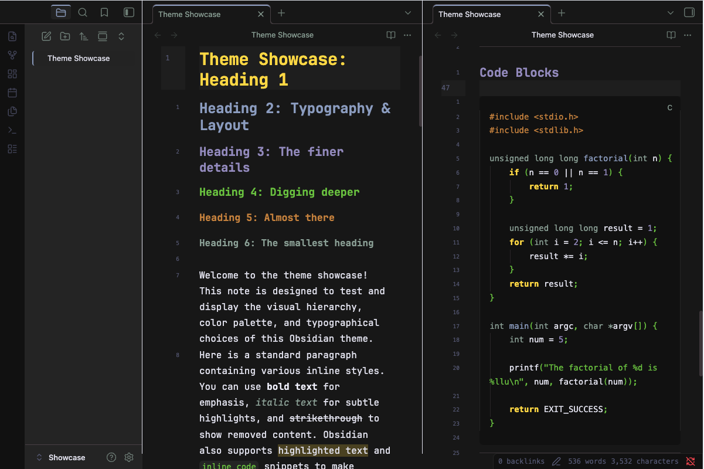

# Gruber Darker — Obsidian Theme

> A faithful Obsidian port of the beloved **Gruber Darker** color theme.  
> Deep blacks. Rich warm accents. Comfortable at any hour.

Originally created for BBEdit by [John Gruber](https://daringfireball.net/), adapted for Emacs by [Jason R. Blevins](https://jblevins.org/projects/emacs-color-themes/) and [Alexey Kutepov (rexim)](https://github.com/rexim/gruber-darker-theme). Now brought to Obsidian.

---

## Features

- ✅ Full dark mode with the canonical Gruber Darker palette
- ✅ Warm light mode fallback
- ✅ All Obsidian 1.0+ CSS variables — clean, low-specificity selectors
- ✅ Rich syntax highlighting (editor + reading view)
- ✅ **Style Settings plugin support** — tweak almost everything without touching CSS
- ✅ **Vim cursor** — block / underline / bar shapes, per-mode colors, 5 blink animations
- ✅ Vim mode status bar indicator (color-coded per mode)
- ✅ Headings H1–H6 each with a distinct palette color
- ✅ Graph view, callouts, tables, tags, blockquotes, frontmatter
- ✅ Canvas, Mermaid diagrams, PDF embeds
- ✅ No remote assets — fully offline compatible

-> see [Theme Preview](details.png)

---

## Style Settings

Install the [Style Settings](https://github.com/obsidian-community/obsidian-style-settings) plugin to access the full settings panel under **Settings → Style Settings → Gruber Darker**.

### Available settings

| Section | Options |
|---------|---------|
| **Palette Overrides** | All 17 palette colors individually |
| **Editor** | Font size, line height, max width, readable line length, line numbers, active line highlight, indent guides, smooth scrolling |
| **Headings** | H1–H4 size sliders, text transform |
| **Code Blocks** | Font size, border toggle |
| **Interface** | Sidebar width, tab style (default / underline / pill), hide ribbon, compact status bar |
| **Callouts** | Corner radius, icon blend mode |
| **Vim & Cursor** | Cursor color, Vim NORMAL shape (block/underline/bar), blink style (static/blink/fade/pulse/expand), per-mode colors (NORMAL/INSERT/VISUAL/REPLACE), mode indicator in status bar |

---

## Vim Cursor Details

| Setting | Options |
|---------|---------|
| **Shape** | Block █ · Underline _ · Bar \| |
| **Blink** | Static · Blink · Fade · Pulse · Expand |
| **NORMAL color** | Default: yellow `#ffdd33` |
| **INSERT color** | Default: green `#73c936` |
| **VISUAL color** | Default: wisteria `#9e95c7` |
| **REPLACE color** | Default: red `#f43841` |

The status bar indicator requires a plugin that adds a Vim mode element to the status bar (e.g. **Vim Mode Status Bar**).

---

## Palette

| Name | Hex | Role |
|------|-----|------|
| bg-1 | `#101010` | Deepest background, gutters |
| bg | `#181818` | Primary background |
| bg+1 | `#282828` | Secondary background |
| bg+2 | `#453d41` | Borders, dividers |
| bg+3 | `#484848` | Selection |
| bg+4 | `#52494e` | Tooltips, match highlight |
| fg | `#e4e4ef` | Main body text |
| fg+1 | `#f4f4ff` | Bright foreground / bold |
| yellow | `#ffdd33` | Keywords, H1, cursor |
| green | `#73c936` | Strings, H4, success |
| niagara | `#96a6c8` | Links, functions, H2 |
| wisteria | `#9e95c7` | Visited links, H3 |
| brown | `#cc8c3c` | Comments, H5 |
| quartz | `#95a99f` | Constants, muted text |
| niagara-dim | `#5f627f` | Faint text, line numbers |
| red | `#f43841` | Errors, tags |
| red+1 | `#ff4f58` | Brighter errors |

---

## Installation

### Via Community Themes (recommended)
1. **Settings → Appearance → Themes → Manage**
2. Search for `Gruber Darker`
3. Click **Install and use**

### Manual
1. Copy the `gruber-darker/` folder into `YourVault/.obsidian/themes/`
2. **Settings → Appearance → Themes** → select **Gruber Darker**
(you may need to rename the folder to something else like Gruber Darker, also reopen Obsidian)

---

## License

Color palette ported from:
- **Gruber Dark for BBEdit** — © John Gruber, [Daring Fireball](https://daringfireball.net/)
- **gruber-darker-theme.el** — © 2009–2016 Jason R. Blevins; © 2013 Alexey Kutepov (rexim)

Both released under the **MIT License**. This Obsidian port is also [MIT licensed](LICENSE).

---

## Contributing

Issues and PRs welcome. If you find an element that needs styling, or something looks off, please open an issue.
